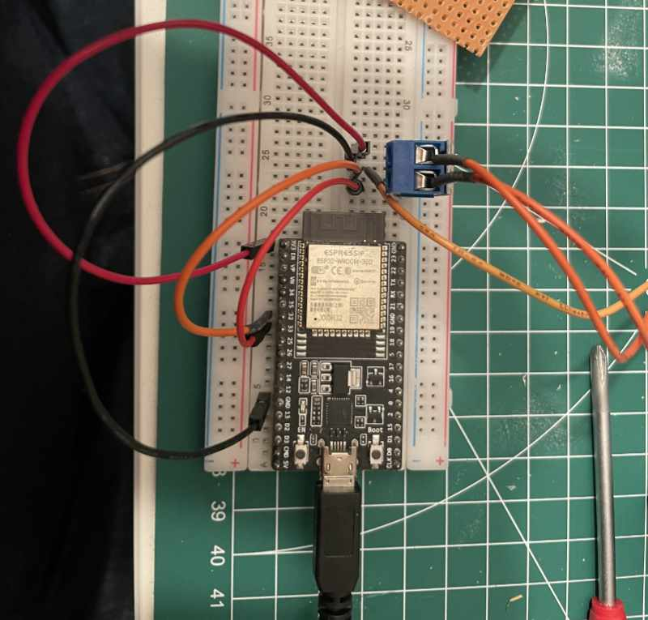
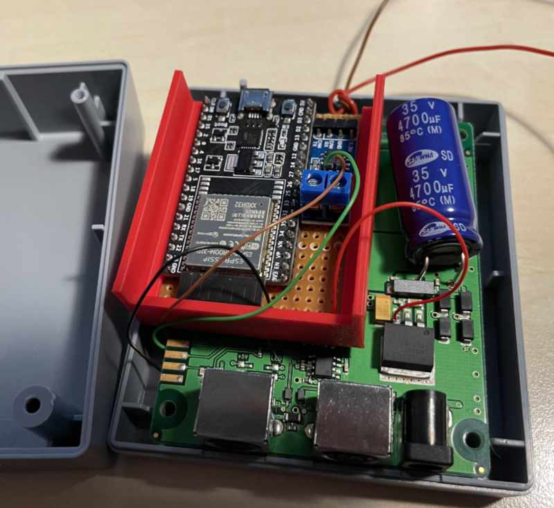
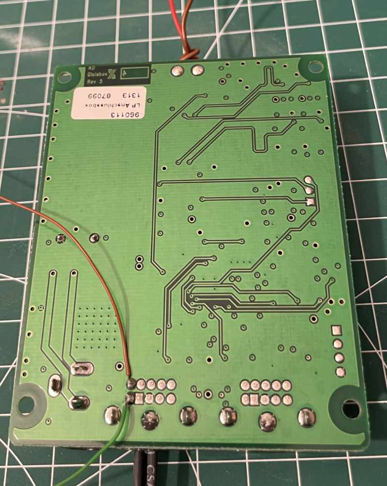
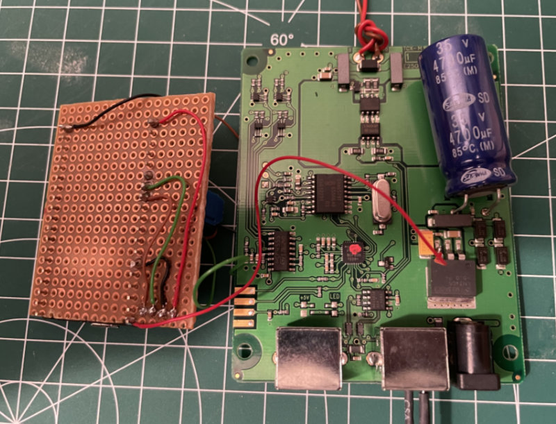

# can2wifi

The can2wifi project uses the popular ESP32 and a CAN transceiver to bridge the CAN bus of a Märklin/Trix 60113 Gleisbox/track box to TCP via WiFi. It allows to monitor and control the same equipment as the Mobile Station(s) 2 using PC software like [Rocrail](https://www.rocrail.online/), a tablet, a mobile or some controller built by yourself.

This project is based on following sources:
- a similar project on [https://mobatron.4lima.de/2022/05/esp8266-und-ms2](https://mobatron.4lima.de/2022/05/esp8266-und-ms2)
- the Gleisbox connector diagram on [https://www.skrauss.de/modellbahn/canbus_stecker.html](https://www.skrauss.de/modellbahn/canbus_stecker.html)
- the Märklin CAN / CAN-over-Ethernet specification [https://www.maerklin.de/fileadmin/media/produkte/CS2_can-protokoll_1-0.pdf](https://www.maerklin.de/fileadmin/media/produkte/CS2_can-protokoll_1-0.pdf)

## Features

- CAN bus connectivity (Märklin/Trix flavour)
- Listen on TCP port 15731 for connection requests (the implementation is limited to a single TCP client at a time)
- Forward all CAN messages to the TCP client and vice versa
- WiFi connection to your access point
- mDNS hostname on your network: `can2wifi`
- OTA firmware update service (credentials in `include/secrets.h`)
- Web server (default port 80, [http://can2wifi.local/](http://can2wifi.local/)) for status, statistics, and CAN bus monitoring

## Hardware

- ESP32 development board (e.g. the devkit-v1)
- CAN transceiver (e.g. the SN65HVD230 CAN breakout board from Waveshare)
- Wire the `CAN_TX`, `CAN_RX`, `3V3` and `GND` pins of the ESP32 to the CAN transceiver. The default is to use Pin 33 of the devkit-v1 board for `CAN_TX` and Pin 32 for `CAN_RX`.
- Wire `CANL`, `CANH` and `GND` of the CAN transceiver to your Gleisbox. For testing, put male jumper wires into a Mini-DIN connector of the Gleisbox or, for a more permanent setup, solder them to the Gleisbox board.
- The ESP32 board could be powered by USB or via its 5V input from the 7805 linear regulator in the Gleisbox.

## Getting started

1. Get and wire the hardware as described above.
1. Install [PlatformIO](https://platformio.org) for build management.
1. Clone the repository.
1. Copy [include/secrets-template.h](include/secrets-template.h) to `include/secrets.h` and adapt `WIFI_SSID`, `WIFI_PASS` and `OTA_PASSWORD`.
1. Also configure `CAN_TX_PIN` and `CAN_RX_PIN` in `include/config.h` to match your wiring.
1. Build the firmware. For the first upload to your ESP32, use USB.
1. For subsequent updates, you could also use OTA via the Arduino IDE or PlatformIO:
   - Edit `platformio.ini` → `[env:esp32doit-devkit-v1_ota]` and set `upload_port` to the device IP or `can2wifi.local`. Set `--auth` in the `upload_flags` section to match your `OTA_PASSWORD` in `include/secrets.h`.
   - Then run:
     ```bash
     platformio run -e esp32doit-devkit-v1_ota -t upload
     ```
1. For debugging, monitor the ESP32 devkit's serial output via USB at `115200` baud.
1. Watch the status web page at [http://can2wifi.local/](http://can2wifi.local/).


## Example Trace

Below is an example of CAN bus traffic captured while connected via TCP as shown on the web page:

```
TCP client connected
CAN->TCP  ID=0x00305B0E DLC=0 DATA= | P=0 ADDR=0x5B0E R=0 CMD=18 DLC=0 DATA=
CAN->TCP  ID=0x00317B41 DLC=8 DATA=47 43 86 3B 01 27 00 10 | P=0 ADDR=0x7B41 R=1 CMD=18 DLC=8 DATA=47 43 86 3B 01 27 00 10
TCP->CAN  ID=0x00319B51 DLC=8 DATA=00 00 18 01 02 01 46 FF | P=0 ADDR=0x9B51 R=1 CMD=18 DLC=8 DATA=00 00 18 01 02 01 46 FF
TCP->CAN  ID=0x00009B51 DLC=5 DATA=00 00 00 00 01 | P=0 ADDR=0x9B51 R=0 CMD=00 DLC=5 DATA=00 00 00 00 01
...
```

## Photos of the hardware

Test setup on a breadboard;



More permanent setup on a small perfboard which fits nicely into the Gleisbox / track box:



Wiring between perfboard and Gleisbox (the wire for the ground connection is not shown on the photo; GND is also wired to the back side of the Gleisbox board (e.g. to one of the six thick soldering points of the two Mini-DIN connectors)):




## Troubleshooting
- **CAN bus not working**: Check wiring, verify CAN_TX/RX pins in config.h
- **WiFi not connecting**: Verify credentials in secrets.h and rebuild/reflash after editing
- **mDNS not resolving**: Try IP address directly (check serial output or your router)

## License
See the [LICENSE](LICENSE) file for details.
