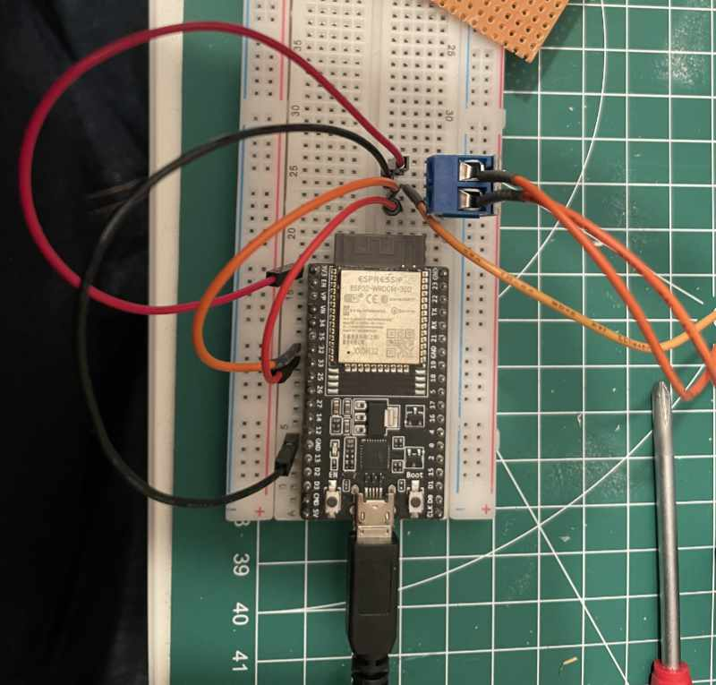
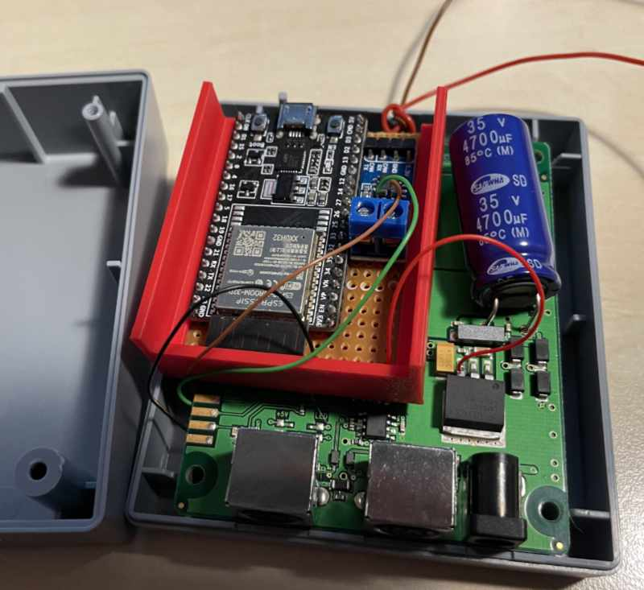
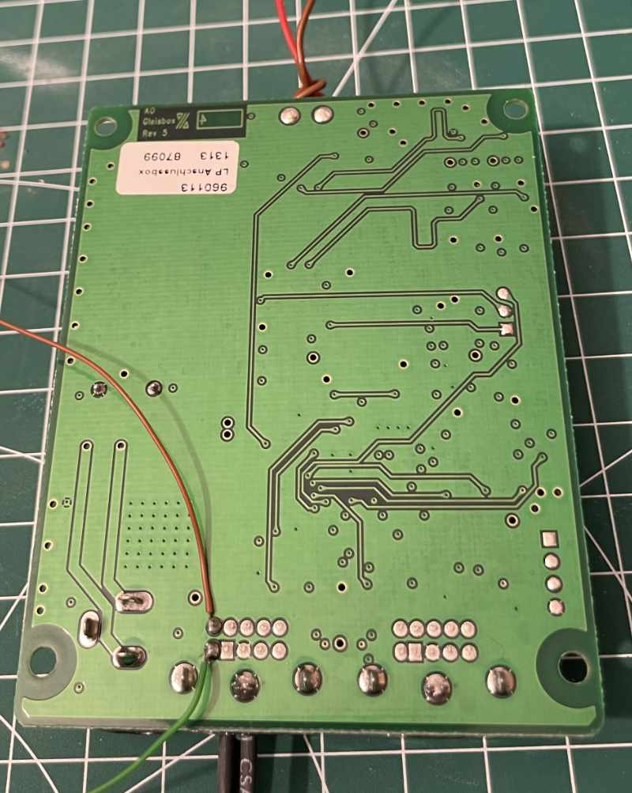
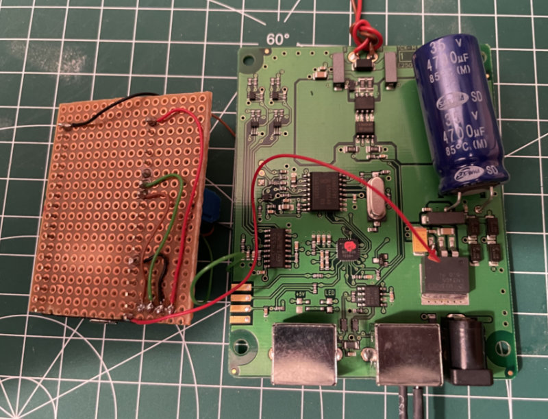

# can2wifi

The can2wifi project uses the popular ESP32 and a CAN transceiver to bridge the CAN bus of a Märklin/Trix 60113 Gleisbox/track box to TCP via WiFi. This allows to monitor and control the same equipment as the Mobile Station(s) 2 using PC software like [Rocrail](https://www.rocrail.online/), a tablet, a mobile or some controller built by yourself.

This project is based on the following sources:
- [ESP8266 und MS2](https://mobatron.4lima.de/2022/05/esp8266-und-ms2) — a similar project using the ESP8266
- [Gleisbox CAN bus connector diagram](https://www.skrauss.de/modellbahn/canbus_stecker.html) by S. Krauss
- [Märklin CAN / CAN-over-Ethernet specification](https://www.maerklin.de/fileadmin/media/produkte/CS2_can-protokoll_1-0.pdf)

## Features

- CAN bus connectivity (Märklin/Trix flavour)
- Listen on TCP port 15731 for connection requests (the implementation is limited to a single TCP client at a time)
- Forward all CAN messages to the TCP client and vice versa
- WiFi connection to your access point
- mDNS hostname on your network: `can2wifi`
- OTA firmware update service (credentials in `include/secrets.h`)
- Web server (default port 80, [http://can2wifi.local/](http://can2wifi.local/)) showing connection status, message counters, and a live CAN bus message log

## Hardware

- ESP32 development board (e.g. the devkit-v1)
- CAN transceiver (e.g. the SN65HVD230 CAN breakout board from Waveshare)

Default wiring between ESP32 devkit-v1 and CAN transceiver (configurable in `include/config.h`):

| ESP32 pin | CAN transceiver pin |
|-----------|---------------------|
| GPIO 33   | TX                  |
| GPIO 32   | RX                  |
| 3V3       | 3V3                 |
| GND       | GND                 |

Connect `CANL`, `CANH` and `GND` of the CAN transceiver to your Gleisbox. For testing, put male jumper wires into a Mini-DIN connector of the Gleisbox or, for a more permanent setup, solder them to the Gleisbox board.

The ESP32 board can be powered by USB or via its 5V input from the 7805 linear regulator in the Gleisbox.

## Getting started

1. Get and wire the hardware as described above.
1. Install [PlatformIO](https://platformio.org) for build management. The required library (`arduinoWebSockets`) is installed automatically by PlatformIO.
1. Clone the repository.
1. Copy [include/secrets-template.h](include/secrets-template.h) to `include/secrets.h` and adapt `WIFI_SSID`, `WIFI_PASS` and `OTA_PASSWORD`.
1. If your wiring differs from the defaults, update `CAN_TX_PIN` and `CAN_RX_PIN` in `include/config.h`.
1. Build the firmware and upload it to your ESP32 via USB for the first time:
   ```bash
   platformio run -e esp32doit-devkit-v1 -t upload
   ```
1. For subsequent updates you can also use OTA:
   - Edit `platformio.ini` → `[env:esp32doit-devkit-v1_ota]`: set `upload_port` to the device IP or `can2wifi.local`, and set `--auth` in `upload_flags` to match your `OTA_PASSWORD`.
   - Then run:
     ```bash
     platformio run -e esp32doit-devkit-v1_ota -t upload
     ```
1. For debugging, monitor the serial output via USB at `115200` baud:
   ```bash
   platformio device monitor
   ```
1. Open the status web page at [http://can2wifi.local/](http://can2wifi.local/).

## Software integration

### Rocrail

In Rocrail, add a new CS2/3 command station and set the interface type to **CS2 (TCP)**. Enter `can2wifi.local` (or the device IP) as the host and `15731` as the port. Rocrail will connect to can2wifi and transparently exchange CAN frames with the Gleisbox.

### Other software

Any software that speaks the Märklin CAN-over-TCP protocol (port 15731, raw CAN frames, no additional framing) can connect to can2wifi directly.

## mDNS / hostname resolution

The device is reachable as `can2wifi.local` on your local network via mDNS. Platform notes:

- **macOS**: works out of the box (Bonjour built in)
- **Windows**: requires [Bonjour](https://support.apple.com/downloads/bonjour) (bundled with iTunes or available separately)
- **Linux**: requires `avahi-daemon` (`sudo apt install avahi-daemon`)

If mDNS does not work, use the device IP address directly. The assigned IP is printed on the serial console at startup and is usually visible in your router's DHCP client list.

## Example Trace

Below is an example of CAN bus traffic captured while connected via TCP as shown on the web page:

```
TCP client connected
CAN->TCP  ID=0x00305B0E DLC=0 DATA= | P=0 ADDR=0x5B0E R=0 CMD=18 DLC=0 DATA=
CAN->TCP  ID=0x00317B41 DLC=8 DATA=47 43 86 3B 01 27 00 10 | P=0 ADDR=0x7B41 R=1 CMD=18 DLC=8 DATA=47 43 86 3B 01 27 00 10
TCP->CAN  ID=0x00319B51 DLC=8 DATA=00 00 18 01 02 01 46 FF | P=0 ADDR=0x9B51 R=1 CMD=18 DLC=8 DATA=00 00 18 01 02 01 46 FF
TCP->CAN  ID=0x00009B51 DLC=5 DATA=00 00 00 00 01 | P=0 ADDR=0x9B51 R=0 CMD=00 DLC=5 DATA=00 00 00 00 01
...
```

## Photos of the hardware

Test setup on a breadboard:



More permanent setup on a small perfboard which fits nicely into the Gleisbox / track box:



Wiring between perfboard and Gleisbox (the wire for the ground connection is not shown on the photo; GND is also wired to the back side of the Gleisbox board (e.g. to one of the six thick soldering points of the two Mini-DIN connectors)):




## Troubleshooting

- **CAN bus not working**: Check wiring; verify `CAN_TX_PIN` / `CAN_RX_PIN` in `include/config.h` match your actual wiring. The serial console logs CAN errors on startup.
- **WiFi not connecting**: Verify `WIFI_SSID` and `WIFI_PASS` in `include/secrets.h`, then rebuild and reflash. The serial console shows the connection attempt and assigned IP.
- **mDNS not resolving**: See the [mDNS section](#mdns--hostname-resolution) above. As a fallback, use the device IP address directly.
- **OTA upload failing**: Confirm `upload_port` and `--auth` in `platformio.ini` match `OTA_PASSWORD` in `include/secrets.h`. Make sure the device is reachable on the network.
- **Only one TCP client supported**: can2wifi accepts a single TCP connection at a time. Close any existing connection (e.g. in Rocrail) before connecting another client.

## License

See the [LICENSE](LICENSE) file for details.
